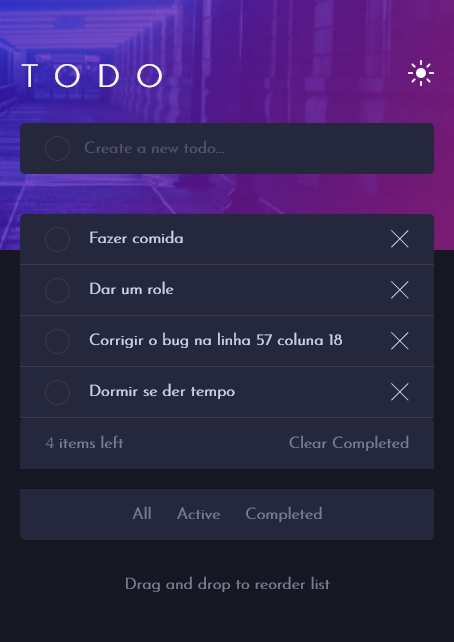
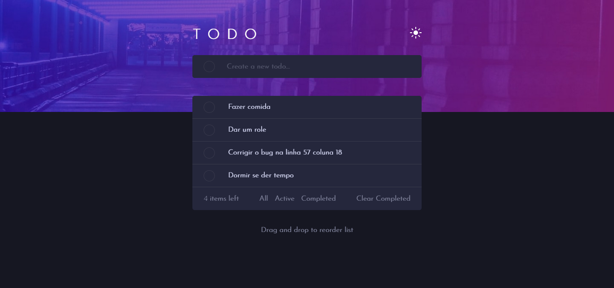

# Frontend Mentor - Todo app
- First time using react JS
- Estimated date to finish: doing at least 1 hour everyday, on 30/06 it is over, I hope.
- Deploy made on 26/06/2021 at 16:47, 4 days before the expected date 🙆‍♂️🙆‍♂️

## Overview

### The challenge

Users should be able to:

- View the optimal layout for the app depending on their device's screen size
- See hover states for all interactive elements on the page
- Add new todos to the list
- Mark todos as complete
- Delete todos from the list
- Filter by all/active/complete todos
- Clear all completed todos
- Toggle light and dark mode
- **Bonus**: Drag and drop to reorder items on the list
- **My Bonus**: See smooth alerts with [SweetAlert-v1](https://sweetalert.js.org/guides/) 

### Screenshot





### Links

- Solution URL: [Github repository](https://github.com/Romario-Negreiros/Todo-App)
- Live Site URL: [Todo App](https://todo-app-delta-pied.vercel.app)

## My process

### Built with

- Semantic HTML5 markup
- Flexbox
- Mobile-first workflow
- [React](https://reactjs.org/) - JS library
- React Hooks
- [React-beatiful-dnd](https://github.com/atlassian/react-beautiful-dnd) - Smooth and pretty drag and drop for react
- [SweetAlert-v1](https://sweetalert.js.org/guides/) - JS library

### What I learned

Some of the most important things I learned is how to use react hooks, as i am a newbie with react, it was a great practice for learning how to use the basics of this feature.
I also learned how to add some other libraries to my projects, how to deploy and host my site, using vercel.

```html
<h1>Coded with ❤ by Romario Negreiros</h1>
```
### Useful resources

-  [Vercel](https://vercel.com) - This amazing site hosted my todo for free, and very simple to use.
- [Tutorial](https://www.youtube.com/watch?v=TWTAuGEi6KU) - And this incredible tutorial helped me on how to use vercel, and deploy my project, but it's in Portuguese 🤷‍♂️

## Author

- Website - [Romario Negreiros](https://meu-portfolio-izui59udw-romario-negreiros.vercel.app)
- Frontend Mentor - [@Romario-Negreiros](https://www.frontendmentor.io/profile/Romario-Negreiros)
- Github profile - [Romario-Negreiros](https://github.com/Romario-Negreiros)
